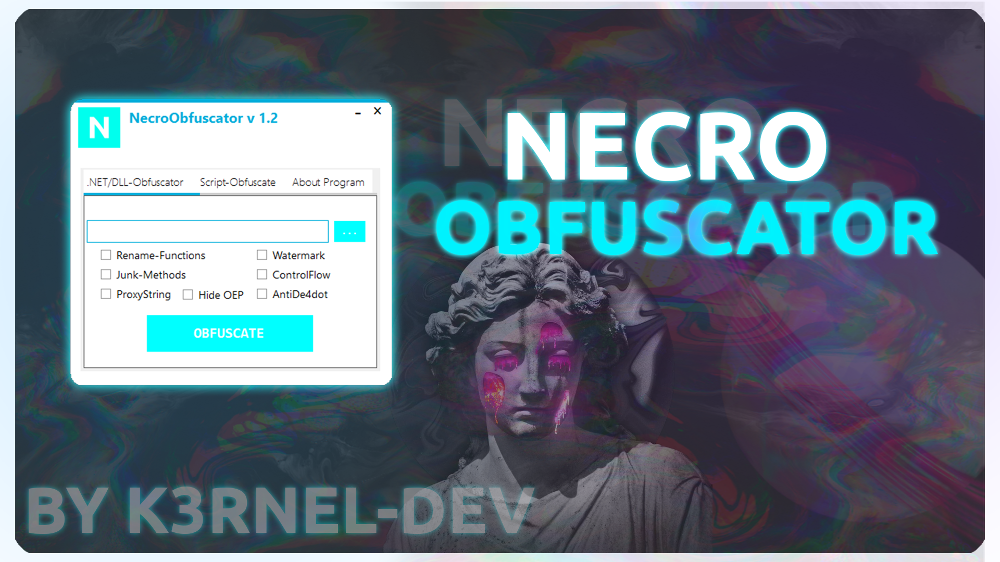
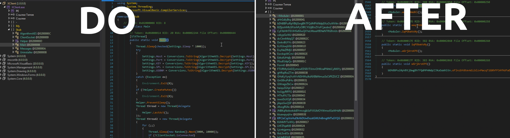
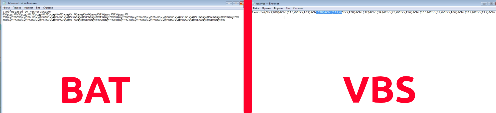

# NecroObfuscator v 1.2



## 🅰️ About:
```
A simple obfuscation tool designed to obfuscate executables and scripts or to confuse patterns in executables.
This project serves as an example of a custom obfuscator that uses various custom techniques.
The project will be developed and include new features and design changes.
```

## 🏴‍☠️ Features:
- **Non-destructive Obfuscation**: Ensures that the file remains fully functional after the obfuscation process, preserving its original behavior and integrity.
- **Script Support**: Capable of obfuscating various script types including .bat and .vbs files, in addition to standard executable files.
- **Core Obfuscation Methods**:
  - **ControlFlow**: Alters the logical flow of execution within the code to make it more difficult to understand and analyze.
  - **JunkMethods**: Inserts meaningless methods and code segments that do not affect the program’s functionality but make the codebase more complex and harder to decipher.
  - **ProxyString**: Hides string literals by using proxy objects, complicating the process of identifying and extracting string data.
  - **HideOEP**: Conceals the Original Entry Point (OEP) of the executable.
  - **RenameFunctions**: Renames functions and methods to obscure their purpose and increase the difficulty of code analysis.
- **Auxiliary Features**:
  - **AntiDe4Dot**: Provides protection against De4Dot, a tool commonly used to deobfuscate .NET assemblies.
  - **Watermark**: feature to indicate that a file has been obfuscated using a necro-obfuscator :D.

## 📷 Obfuscation-Review:



## 📷 Video-Proof:
https://github.com/user-attachments/assets/99f4c1cc-3182-4857-afa9-a9a9e66e4059


## 👤 Meta-Info:
```
If you have questions contact me:
Telegram: @K666Plus
```

## ⚠️ Disclaimer:
```
This open-source project is provided for educational purposes only. 
The author assumes no responsibility for any misuse or illegal activities performed with this software.
Users are solely responsible for ensuring that their use of this tool complies with all applicable laws and regulations.
```
